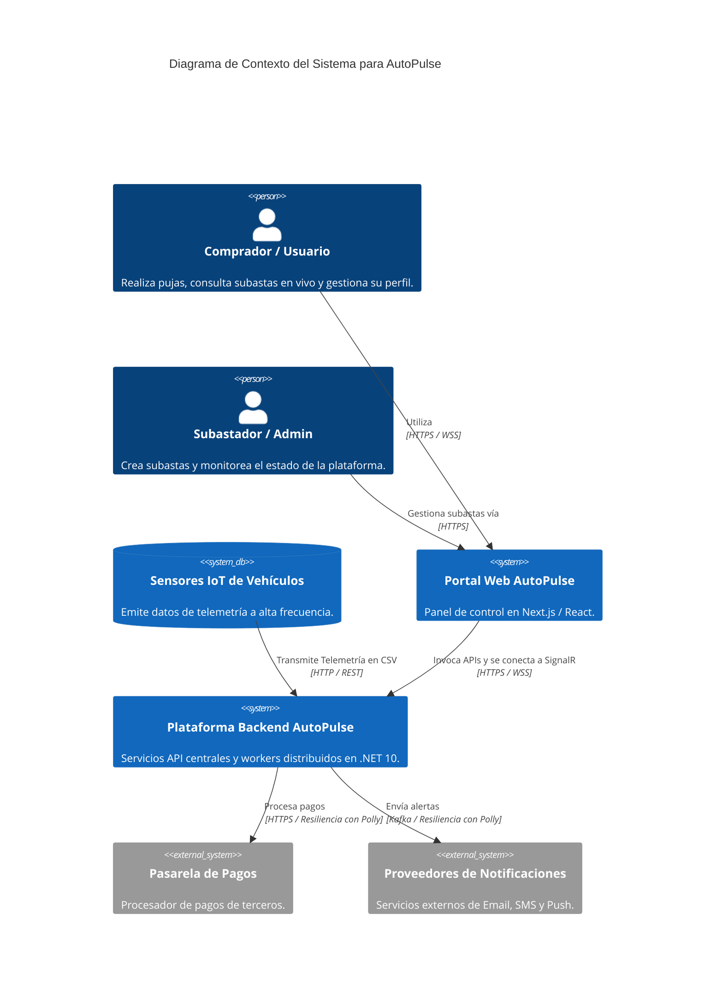
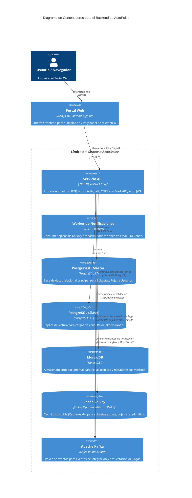
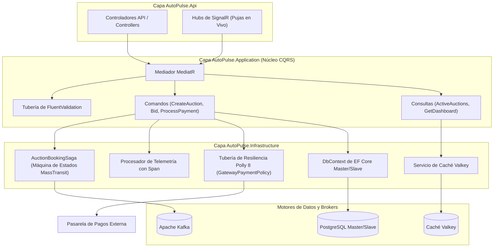
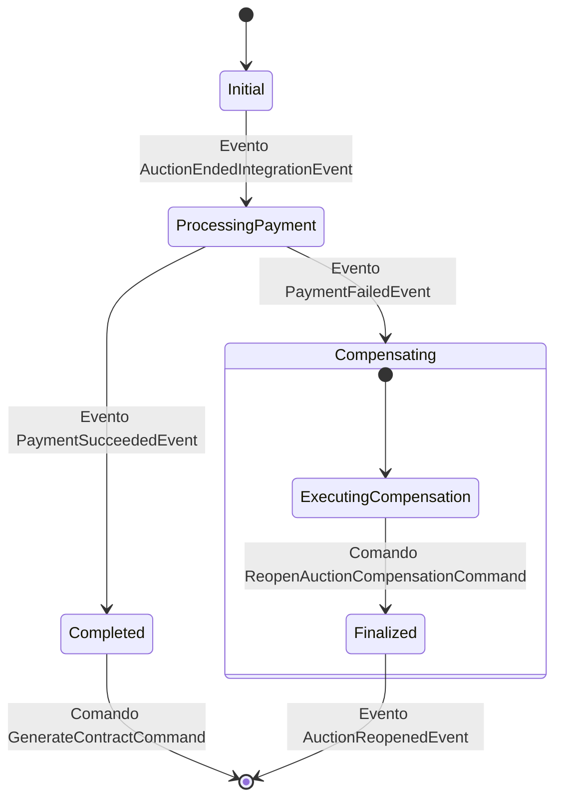
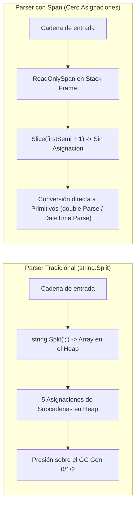
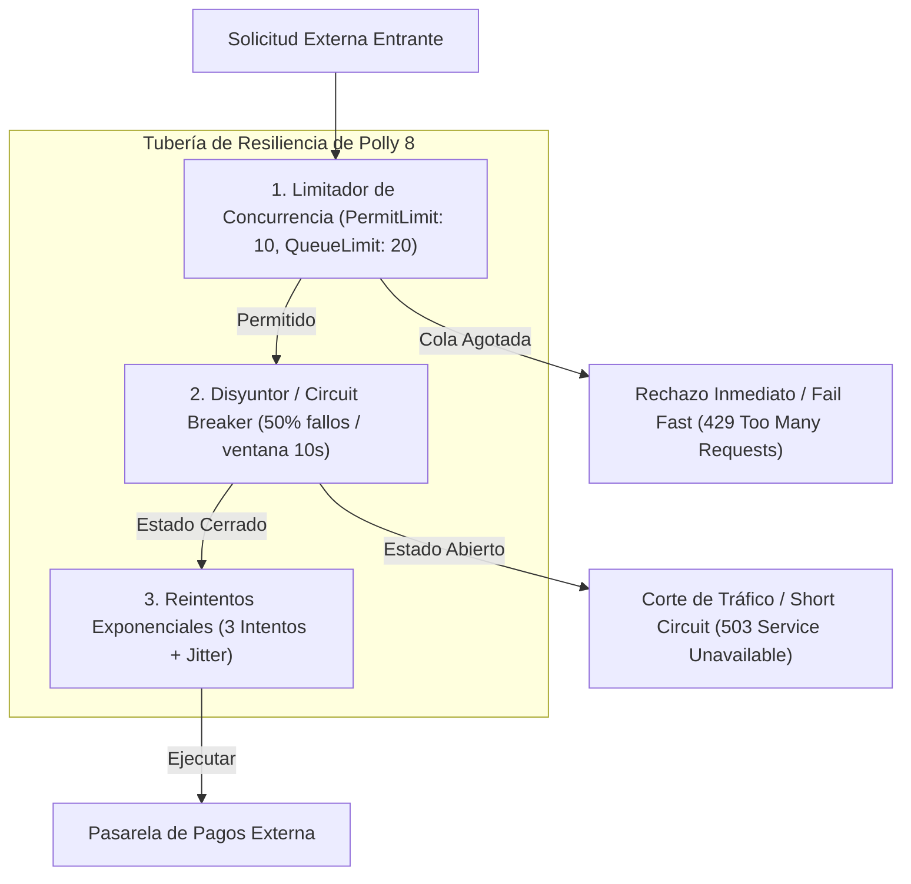

# AutoPulse 🚗⚡

AutoPulse es una plataforma distribuida y de alta concurrencia diseñada para subastas de vehículos en vivo y monitoreo de telemetría en tiempo real. Construida sobre .NET 10 bajo los principios de Arquitectura Limpia (Clean Architecture), la aplicación integra almacenamiento relacional y NoSQL, caché distribuida, tuberías de resiliencia, optimizaciones de memoria con cero asignaciones en el heap y mensajería orientada a eventos.

---

## 🏛️ Arquitectura del Sistema y Modelo C4

AutoPulse está estructurado en base a **Arquitectura Limpia (Clean Architecture)** y documentado mediante el **Modelo C4** para la visualización de arquitectura de software.

### C4 Nivel 1: Diagrama de Contexto del Sistema

El diagrama de Contexto ilustra cómo los actores externos (Compradores/Pujadores, Subastadores, Sensores IoT) interactúan con la plataforma AutoPulse y sus integraciones externas.



---

### C4 Nivel 2: Diagrama de Contenedores

El diagrama de Contenedores detalla los componentes tecnológicos clave, motores de datos, capas de caché y brokers de eventos dentro del límite de la solución AutoPulse.



---

### C4 Nivel 3: Diagrama de Componentes (Arquitectura Interna)

El diagrama de Componentes muestra la estructura interna de las capas `AutoPulse.Infrastructure`, `AutoPulse.Application` y `AutoPulse.Domain`.



---

## 🔄 Sagas Orientadas a Eventos (`AuctionBookingSaga`)

AutoPulse gestiona transacciones distribuidas complejas (como el cierre de una subasta, el procesamiento de cobros, la generación de contratos o la reversión de subastas ante fallos) utilizando el **Patrón de Saga Coreografiada** implementado mediante la **Máquina de Estados de MassTransit** sobre **Apache Kafka**.

### Flujo de Transición de Estados de la Saga

Cuando una subasta alcanza su fecha de expiración, el sistema inicia la Saga `AuctionBookingSaga` para garantizar **consistencia eventual** entre servicios independientes sin recurrir a bloqueos transaccionales de dos fases (2PC).



### Camino Feliz vs. Camino de Compensación

| Fase | Evento Detonante | Transición de Estado | Comando Despachado / Acción |
| :--- | :--- | :--- | :--- |
| **1. Disparo** | `AuctionEndedIntegrationEvent` | `Initial` ➔ `ProcessingPayment` | Despacha `ProcessPaymentCommand` a `queue:process-payment-service` con el `CorrelationId`. |
| **2a. Éxito** | `PaymentSucceededEvent` | `ProcessingPayment` ➔ `Completed` | Establece la fecha `PaymentProcessedAt` y despacha `GenerateContractCommand` a `queue:contract-service`. |
| **2b. Fallo** | `PaymentFailedEvent` | `ProcessingPayment` ➔ `Compensating` | Dispara compensación: despacha `ReopenAuctionCompensationCommand` a `queue:auction-control-service`. |
| **3. Compensación** | `AuctionReopenedEvent` | `Compensating` ➔ `Finalize` | Revierte el estado de la subasta de `Cerrada` a `Activa`, registra la recuperación en telemetría y finaliza la Saga. |

### Aspectos Técnicos de la Implementación

```csharp
public class AuctionBookingSaga : MassTransitStateMachine<AuctionBookingSagaState>
{
    public State ProcessingPayment { get; private set; }
    public State Completed { get; private set; }
    public State Compensating { get; private set; }

    public AuctionBookingSaga()
    {
        InstanceState(x => x.CurrentState);

        // Correlaciona eventos entrantes mediante un Correlation ID único de la Saga
        Event(() => AuctionEnded, x => x.CorrelateById(context => context.Message.EventId));
        Event(() => PaymentSucceeded, x => x.CorrelateById(context => context.Message.EventId));
        Event(() => PaymentFailed, x => x.CorrelateById(context => context.Message.EventId));

        During(Initial,
            When(AuctionEnded)
                .Then(ctx => { ctx.Saga.AuctionId = ctx.Message.AuctionId; ctx.Saga.WinnerId = ctx.Message.WinnerId; })
                .TransitionTo(ProcessingPayment)
                .Send(new Uri("queue:process-payment-service"), ctx => new ProcessPaymentCommand(...))
        );

        During(ProcessingPayment,
            When(PaymentSucceeded)
                .TransitionTo(Completed)
                .Send(new Uri("queue:contract-service"), ctx => new GenerateContractCommand(...)),
            When(PaymentFailed)
                .TransitionTo(Compensating)
                .Send(new Uri("queue:auction-control-service"), ctx => new ReopenAuctionCompensationCommand(...))
        );
    }
}
```

---

## ⚡ Analizador de Telemetría de Alto Rendimiento (`Span<T>`)

Los sensores IoT de los vehículos transmiten datos de telemetría a alta frecuencia (coordenadas GPS, velocidades del motor, marcas de tiempo) en formato de cadenas CSV (ejemplo: `V-102938;4.60971;-74.08175;88.5;2026-07-28T10:45:00Z`). Procesar millones de estas líneas utilizando operaciones tradicionales de cadenas genera asignaciones masivas en el heap y provoca pausas del Garbage Collector (GC).

AutoPulse implementa un **Parser de Telemetría con Cero Asignaciones** utilizando `ReadOnlySpan<char>` y `Span<T>` de C#.

### Gestión de Memoria: Enfoque Tradicional vs. Enfoque con `Span<T>`



### Comparación de Código

#### ❌ Implementación Tradicional (`string.Split`)
```csharp
public TelemetryDataDto? NaiveProcessTelemetry(string csvLine)
{
    var parts = csvLine.Split(';'); // ⚠️ ¡Asigna un arreglo string[] e instancias de cadenas para cada elemento en el Heap!

    return new TelemetryDataDto(
        parts[0].AsMemory(),
        double.Parse(parts[1], CultureInfo.InvariantCulture),
        double.Parse(parts[2], CultureInfo.InvariantCulture),
        double.Parse(parts[3], CultureInfo.InvariantCulture),
        DateTime.Parse(parts[4], CultureInfo.InvariantCulture)
    );
}
```

#### ✅ Implementación Optimizada (`ReadOnlySpan<char>`)
```csharp
public TelemetryDataDto? SpanProcessTelemetry(string csvLine)
{
    ReadOnlySpan<char> span = csvLine.AsSpan(); // Referencia en Stack, ¡cero asignación!
    
    int firstSemi = span.IndexOf(";");
    if (firstSemi == -1) return null;
    ReadOnlyMemory<char> vehicleMemory = csvLine.AsMemory(0, firstSemi);

    ReadOnlySpan<char> remaining = span.Slice(firstSemi + 1);
    int secondSemi = remaining.IndexOf(";");
    ReadOnlySpan<char> latSpan = remaining.Slice(0, secondSemi); // ¡Slice no genera objetos en el Heap!

    remaining = remaining.Slice(secondSemi + 1);
    int thirdSemi = remaining.IndexOf(";");
    ReadOnlySpan<char> lonSpan = remaining.Slice(0, thirdSemi);

    remaining = remaining.Slice(thirdSemi + 1);
    int fourthSemi = remaining.IndexOf(";");
    ReadOnlySpan<char> speedSpan = remaining.Slice(0, fourthSemi);

    ReadOnlySpan<char> dateSpan = remaining.Slice(fourthSemi + 1);

    return new TelemetryDataDto(
        vehicleMemory,
        double.Parse(latSpan, CultureInfo.InvariantCulture),   // ¡Convierte directamente desde ReadOnlySpan<char>!
        double.Parse(lonSpan, CultureInfo.InvariantCulture),
        double.Parse(speedSpan, CultureInfo.InvariantCulture),
        DateTime.Parse(dateSpan, CultureInfo.InvariantCulture)
    );
}
```

### Métricas del Benchmark (`/api/telemetry/benchmark`)

El endpoint ejecuta 500,000 iteraciones continuas de análisis bajo carga para evaluar la recolección del GC y la duración total de ejecución:

| Estrategia del Parser | Tiempo de Ejecución (500k ops) | Asignación en Heap | Recolecciones GC Gen 0 | Recolecciones GC Gen 1 | Recolecciones GC Gen 2 |
| :--- | :--- | :--- | :--- | :--- | :--- |
| **Tradicional (`string.Split`)** | ~480 ms | ~48 MB | ~14 Recolecciones | ~3 Recolecciones | ~0 Recolecciones |
| **Optimizado (`Span<T>`)** | **~110 ms (4.3x más rápido)** | **~0 Bytes (Heap)** | **0 Recolecciones** | **0 Recolecciones** | **0 Recolecciones** |

---

## 🛡️ Políticas de Resiliencia y Tolerancia a Fallos con Polly 8

Para proteger el sistema contra fallos en cascada, picos de latencia en la red y caídas temporales de la pasarela de pagos externa, AutoPulse utiliza **Tuberías de Resiliencia de Polly 8** configuradas mediante las bibliotecas oficiales de Microsoft (`Microsoft.Extensions.Resilience`).

### Tubería de Defensa en 3 Capas (`GatewayPaymentPolicy`)

Las solicitudes salientes hacia pasarelas de pago y proveedores de notificaciones atraviesan una estrategia defensiva en 3 niveles:



### Detalle de Capas y Configuración

```csharp
services.AddResiliencePipeline(GatewayPaymentPolicy, (builder, context) =>
{
    var logger = context.ServiceProvider.GetRequiredService<ILogger<ResiliencePipeline>>();

    builder
        // 1. Capa Limitadora de Concurrencia (Protege ante picos masivos)
        .AddConcurrencyLimiter(new ConcurrencyLimiterOptions
        {
            PermitLimit = 10,  // Máximo 10 hilos concurrentes procesando pagos
            QueueLimit = 20    // Máximo 20 solicitudes en cola antes de Fail-Fast
        })

        // 2. Capa de Disyuntor / Circuit Breaker (Evita saturar servicios caídos)
        .AddCircuitBreaker(new CircuitBreakerStrategyOptions
        {
            FailureRatio = 0.5,                    // Abre el circuito si el 50% de peticiones falla
            SamplingDuration = TimeSpan.FromSeconds(10),
            MinimumThroughput = 4,                 // Requiere al menos 4 peticiones de muestra
            BreakDuration = TimeSpan.FromSeconds(30),// Mantiene el circuito abierto durante 30s
            OnOpened = args => { logger.LogCritical("[Circuit Breaker] ¡ABIERTO! Tráfico bloqueado."); return ValueTask.CompletedTask; },
            OnClosed = args => { logger.LogInformation("[Circuit Breaker] CERRADO. Servicio restablecido."); return ValueTask.CompletedTask; },
            OnHalfOpened = args => { logger.LogWarning("[Circuit Breaker] PRUEBA (Half-Open). Evaluando tráfico..."); return ValueTask.CompletedTask; }
        })

        // 3. Capa de Reintentos Exponenciales con Jitter (Maneja fallos de red transitorios)
        .AddRetry(new RetryStrategyOptions
        {
            MaxRetryAttempts = 3,
            BackoffType = DelayBackoffType.Exponential,
            UseJitter = true,                      // Previene el efecto de manada (thundering herd)
            Delay = TimeSpan.FromSeconds(2),       // Demora inicial: 2s, 4s, 8s (+ jitter aleatorio)
            OnRetry = args => { logger.LogWarning($"[Retry] Intento #{args.AttemptNumber}. Esperando {args.RetryDelay}."); return ValueTask.CompletedTask; }
        });
});
```

---

## 📂 Estructura de Directorios

```lic
AutoPulse/
├── AutoPulse.Domain/             # Núcleo del Negocio: Entidades, Objetos de Valor, Eventos de Dominio
│   ├── Entities/                 
│   │   ├── Sql/                  # Entidades relacionales PostgreSQL (Auction, Bid, Vehicle, User)
│   │   └── NoSql/                # Documentos NoSQL MongoDB (VehicleSpecificationDocument)
│   └── ValueObjects/             # Tipos de dominio inmutables
├── AutoPulse.Application/        # Reglas de Negocio de la Aplicación: Commands, Queries, Validadores
│   └── Application/
│       ├── Auctions/             # Manejadores, DTOs y validaciones del dominio de Subastas
│       │   ├── Commands/         # Controladores de escritura CQRS (Close, Create, Bid, pasos de Saga)
│       │   └── Queries/          # Controladores de lectura CQRS (Dashboard, List, User Bids)
│       └── Common/               # Comportamientos, interfaces y mapeos comunes
├── AutoPulse.Infrastructure/     # Frameworks, Migraciones de BD, Adaptadores e Integraciones Externas
│   ├── Persistence/              
│   │   ├── Sql/                  # DbContext de EF Core (Configuraciones de Master/Slave)
│   │   └── NoSql/                # Cliente y colecciones de MongoDB
│   ├── Messaging/                # Máquinas de estado de Sagas en MassTransit, consumidores/productores de Kafka
│   ├── Resilience/               # Constructor y configuraciones de tuberías de resiliencia con Polly 8
│   └── Cache/                    # Implementaciones de caché distribuida con Valkey
├── AutoPulse.Api/                # Punto de Entrada: Controladores HTTP, Hubs de SignalR, Middlewares
│   └── Controllers/              # Endpoints de la API (Auctions, Auth, Telemetry)
└── AutoPulse.Notifications/      # Servicio independiente de notificaciones (Ingestión, Workers)
```

---

## 📦 Stack Tecnológico y Versiones de Paquetes

### Entorno Base
* **Plataforma:** .NET 10.0 (`net10.0`)
* **Bases de datos:** PostgreSQL 17 (Relacional Master/Slave), MongoDB 7 (NoSQL Documental)
* **Message Broker:** Apache Kafka (modo KRaft)
* **Caché:** Valkey 8 (compatible con Redis)

### Dependencias de Paquetes

| Paquete | Versión | Descripción |
| :--- | :--- | :--- |
| `MediatR` | `14.1.0` | Despacho de peticiones/respuestas para CQRS |
| `MassTransit` | `8.4.1` | Abstracción de bus de servicios y Sagas con Máquina de Estados sobre Kafka |
| `Microsoft.EntityFrameworkCore` | `10.0.9` | ORM para el acceso relacional a PostgreSQL |
| `MongoDB.Driver` | `3.9.0` | Biblioteca cliente para almacenamiento de fichas técnicas en MongoDB |
| `Polly` & `Polly.Extensions` | `8.7.0` | Tuberías de resiliencia (Rate limiter, Circuit Breaker, Reintentos Exponenciales) |
| `FluentValidation` | `11.11.0` | Validación fuertemente tipada de comandos del dominio |
| `BCrypt.Net-Next` | `4.2.0` | Utilidad de hashing y cifrado de contraseñas |
| `HtmlSanitizer` | `9.0.892` | Sanitización de entradas de texto generadas por usuarios |
| `Microsoft.Extensions.Caching.StackExchangeRedis` | `10.0.9` | Adaptador proveedor de caché para Valkey |

---

## 🔌 Referencia de Endpoints de la API

Todos los endpoints están alojados bajo `http://localhost:5000/api`.

### 🔐 Autenticación (`/api/auth`)

* **`POST /api/auth/register`**
  - Registra un nuevo usuario en la plataforma.
  - *Payload:* `RegisterUserCommand`
* **`POST /api/auth/login`**
  - Autentica credenciales, retorna los tokens JWT y establece las cookies seguras HTTP-Only (`autopulse-session`, `autopulse-refresh-token`).
  - *Payload:* `LoginUserCommand`
* **`POST /api/auth/refresh-token`**
  - Rota los tokens expirados utilizando las cookies de la petición o un valor alternativo en el payload.
  - *Payload:* `RefreshTokenCommand` (Opcional si las cookies están presentes)
* **`POST /api/auth/logout`**
  - Revoca la sesión activa del usuario y limpia las cookies del cliente.
  - *Payload:* `LogoutUserCommand`
* **`GET /api/auth/profile`** [Autorizado]
  - Recupera los datos del perfil y permisos de autorización del usuario autenticado.

### 🔨 Subastas (`/api/auctions`)

* **`GET /api/auctions/active`** [Autorizado: `Auctions.Read`]
  - Obtiene una lista filtrada y paginada de las subastas activas junto con los detalles del vehículo.
* **`GET /api/auctions/{id}`** [Autorizado: `Auctions.Read`]
  - Obtiene los datos detallados de una subasta específica.
* **`GET /api/auctions/{id}/dashboard`** [Autorizado: `Auctions.Read`]
  - Recupera estadísticas en tiempo real del panel de la subasta, incluyendo el historial completo de pujas.
* **`GET /api/auctions/bids/my`** [Autorizado: `Auctions.ReadBids`]
  - Recupera todas las pujas históricas realizadas por el usuario actualmente autenticado.
* **`POST /api/auctions`** [Autorizado: `Auctions.Create`]
  - Crea una nueva subasta en el sistema.
  - *Payload:* `CreateAuctionCommand`
* **`POST /api/auctions/{id}/bids`** [Autorizado: `Auctions.Bid`]
  - Registra una nueva puja en una subasta activa. Realiza validaciones de límites mínimos y de incremento.
  - *Payload:* `CreateAuctionBidCommand`
* **`POST /api/auctions/upload-url`** [Autorizado: `Auctions.Create`]
  - Genera una URL prefirmada segura para cargar documentos legales o títulos de vehículos directamente al almacenamiento en la nube.

### 📈 Telemetría y Benchmarking (`/api/telemetry`)

* **`POST /api/telemetry?method={span|naive}`** [Autorizado: `Telemetry.Process`]
  - Procesa cadenas de datos de sensores crudas provenientes de los dispositivos IoT del vehículo.
* **`POST /api/telemetry/benchmark`** [Autorizado: `Telemetry.Benchmark`]
  - Ejecuta una prueba comparativa de carga masiva (500,000 iteraciones) que mide el rendimiento del análisis tradicional (`string.Split`) frente a la optimización de asignación cero mediante `Span<char>`.
  - Retorna tiempos de ejecución (ms) y cantidad de recolecciones realizadas por el Garbage Collector (Gen 0, 1, 2).

---

## 🛠️ Configuración de Infraestructura Local (Docker Compose)

Los servicios de infraestructura se definen en configuraciones de Compose modulares.

### Comandos de Ejecución

#### 1. Iniciar el Entorno Completo
Levanta la API de backend, Postgres (Master/Slave), Valkey, MongoDB y Apache Kafka:
```bash
docker compose up -d
```

#### 2. Levantar con Inicialización Automática de Datos (Recomendado)
Aplica las migraciones de EF Core e inserta registros de prueba realistas en Postgres y MongoDB automáticamente:
```bash
docker compose --profile seed up -d
```

#### 3. Iniciar Perfiles Específicos
* **Solo Motores de Datos (Postgres, Mongo, Valkey):**
  ```bash
  docker compose -f docker-compose.db.yml -f docker-compose.cache.yml -f docker-compose.mongodb.yml up -d
  ```
* **Solo Mensajería (Kafka):**
  ```bash
  docker compose -f docker-compose.messaging.yml up -d
  ```

### Mapeo de Servicios Locales

| Servicio | Nombre del Contenedor | Puerto Local | Rol |
| :--- | :--- | :--- | :--- |
| **API Backend** | `autopulse-api` | `5000` | Punto de entrada principal de la API (.NET 10) |
| **PostgreSQL (Master)** | `autopulse-postgres-master` | `5432` | Base de datos relacional para escrituras |
| **PostgreSQL (Slave)** | `autopulse-postgres-slave` | `5433` | Réplica de base de datos para lecturas |
| **Valkey** | `autopulse-valkey` | `6379` | Almacenamiento de caché y limitación de tasa (rate limiting) |
| **MongoDB** | `autopulse-mongodb` | `27017` | Base de datos documental para fichas técnicas |
| **Apache Kafka** | `autopulse-kafka` | `9092` | Broker de eventos en modo KRaft |

---

## ✉️ Gestión de Tópicos en Apache Kafka

Para crear los tópicos de mensajería requeridos en el contenedor de Kafka local:

```bash
# Crear tópicos individuales
docker exec -it autopulse-kafka kafka-topics --create --bootstrap-server localhost:9092 --partitions 1 --replication-factor 1 --topic notification.telemetry.events
docker exec -it autopulse-kafka kafka-topics --create --bootstrap-server localhost:9092 --partitions 1 --replication-factor 1 --topic notification.transactional.email
docker exec -it autopulse-kafka kafka-topics --create --bootstrap-server localhost:9092 --partitions 1 --replication-factor 1 --topic notification.transactional.sms
docker exec -it autopulse-kafka kafka-topics --create --bootstrap-server localhost:9092 --partitions 1 --replication-factor 1 --topic notification.transactional.push
docker exec -it autopulse-kafka kafka-topics --create --bootstrap-server localhost:9092 --partitions 1 --replication-factor 1 --topic notification.marketing.bulk
```

### Verificación
```bash
docker exec -it autopulse-kafka kafka-topics --list --bootstrap-server localhost:9092
```
