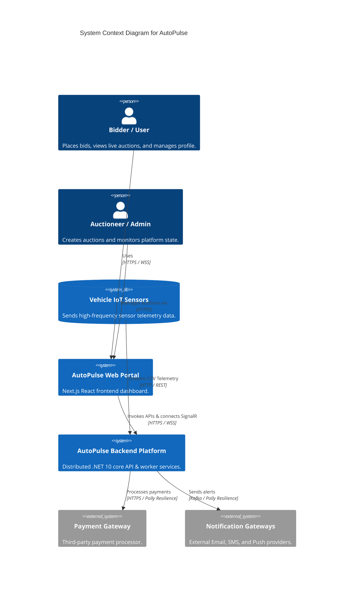
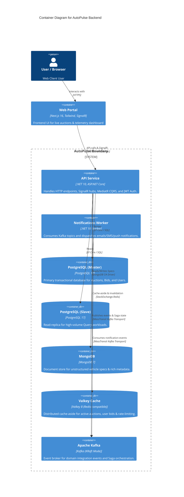
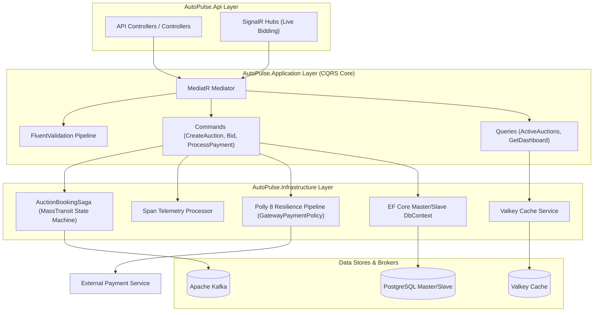
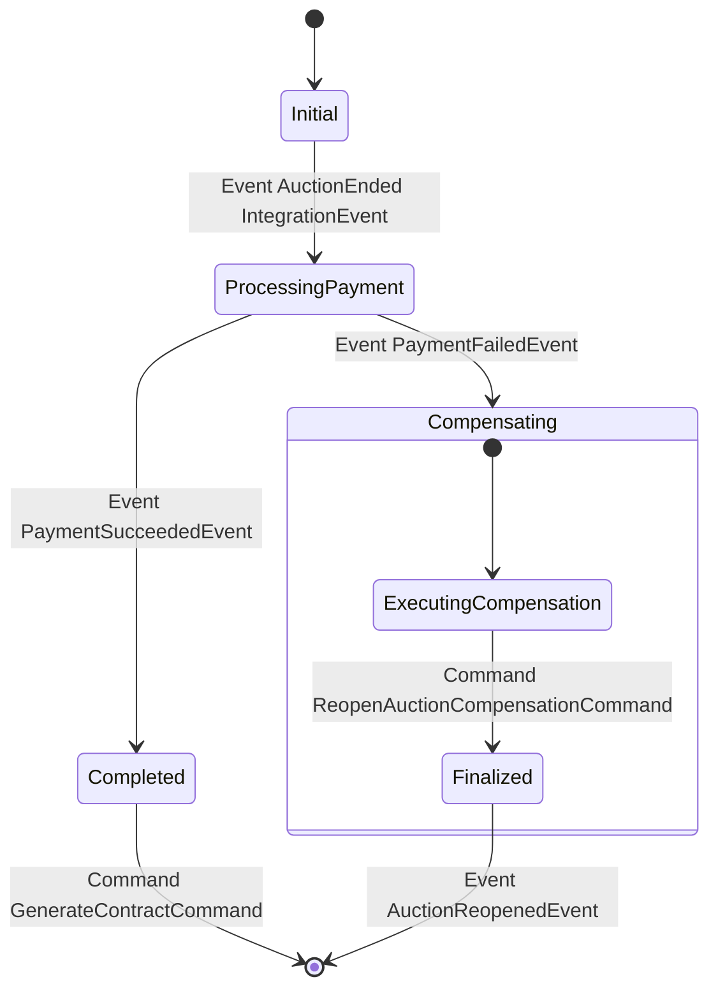
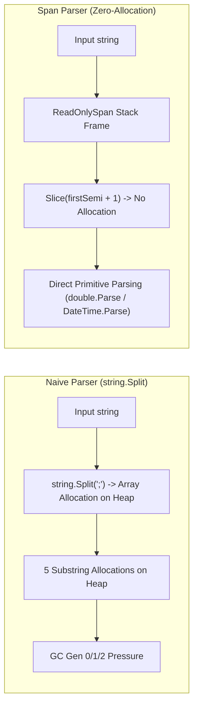
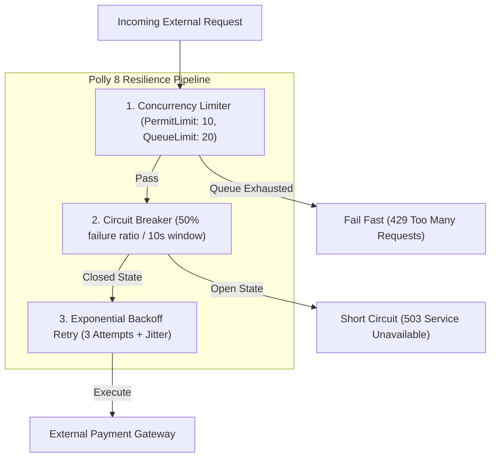

# AutoPulse 🚗⚡

AutoPulse is a high-concurrency, distributed platform for live vehicle auctions and real-time telemetry monitoring. Built on .NET 10 using Clean Architecture, it integrates relational and NoSQL storage, distributed caching, resilience pipelines, zero-allocation memory optimizations, and event-driven messaging.

---

## 🏛️ System Architecture & C4 Model

AutoPulse is structured around **Clean Architecture** principles and documented using the **C4 Model** for software architecture visualization.

### C4 Level 1: System Context Diagram

The System Context diagram illustrates how external actors (Bidders, Auctioneers, IoT Sensors) interact with the AutoPulse platform and its external integrations.



---

### C4 Level 2: Container Diagram

The Container diagram details the high-level technology choices, data stores, cache layer, and event message brokers operating within the AutoPulse solution boundary.



---

### C4 Level 3: Component Diagram (AutoPulse Architecture)

The Component diagram shows the internal structure of the `AutoPulse.Infrastructure`, `AutoPulse.Application`, and `AutoPulse.Domain` layers.



---

## 🔄 Event-Driven Choreographed Sagas (`AuctionBookingSaga`)

AutoPulse handles complex distributed transactions (such as closing an auction, processing payments, generating contracts, or rolling back auction states upon failure) using the **Choreographed Saga Pattern** implemented via **MassTransit State Machine** over **Apache Kafka**.

### Saga State Transition Workflow

When an auction reaches its expiration date, the system initiates `AuctionBookingSaga` to guarantee **eventual consistency** across independent services without requiring two-phase commit (2PC) locks.



### Happy Path vs. Compensation Path

| Phase | Trigger Event | State Transition | Dispatched Command / Action |
| :--- | :--- | :--- | :--- |
| **1. Trigger** | `AuctionEndedIntegrationEvent` | `Initial` ➔ `ProcessingPayment` | Dispatches `ProcessPaymentCommand` to `queue:process-payment-service` with `CorrelationId`. |
| **2a. Success Path** | `PaymentSucceededEvent` | `ProcessingPayment` ➔ `Completed` | Sets `PaymentProcessedAt` timestamp and dispatches `GenerateContractCommand` to `queue:contract-service`. |
| **2b. Failure Path** | `PaymentFailedEvent` | `ProcessingPayment` ➔ `Compensating` | Triggers compensation: dispatches `ReopenAuctionCompensationCommand` to `queue:auction-control-service`. |
| **3. Compensation** | `AuctionReopenedEvent` | `Compensating` ➔ `Finalize` | Reverts the auction state from `Closed` back to `Active`, logs telemetry recovery, and finalizes the Saga instance. |

### Technical Highlights of the Implementation

```csharp
public class AuctionBookingSaga : MassTransitStateMachine<AuctionBookingSagaState>
{
    public State ProcessingPayment { get; private set; }
    public State Completed { get; private set; }
    public State Compensating { get; private set; }

    public AuctionBookingSaga()
    {
        InstanceState(x => x.CurrentState);

        // Correlate incoming events by unique Saga Correlation ID
        Event(() => AuctionEnded, x => x.CorrelateById(context => context.Message.EventId));
        Event(() => PaymentSucceeded, x => x.CorrelateById(context => context.Message.EventId));
        Event(() => PaymentFailed, x => x.CorrelateById(context => context.Message.EventId));

        During(Initial,
            When(AuctionEnded)
                .Then(ctx => { ctx.Saga.AuctionId = ctx.Message.AuctionId; ctx.Saga.WinnerId = ctx.Message.WinnerId; })
                .TransitionTo(ProcessingPayment)
                .Send(new Uri("queue:process-payment-service"), ctx => new ProcessPaymentCommand(...))
        );

        During(ProcessingPayment,
            When(PaymentSucceeded)
                .TransitionTo(Completed)
                .Send(new Uri("queue:contract-service"), ctx => new GenerateContractCommand(...)),
            When(PaymentFailed)
                .TransitionTo(Compensating)
                .Send(new Uri("queue:auction-control-service"), ctx => new ReopenAuctionCompensationCommand(...))
        );
    }
}
```

---

## ⚡ High-Performance Telemetry Parser (`Span<T>`)

Vehicle IoT sensors stream high-frequency telemetry records (GPS coordinates, engine speeds, timestamps) in string formats (e.g. `V-102938;4.60971;-74.08175;88.5;2026-07-28T10:45:00Z`). Parsing millions of these lines using standard string operations creates heavy heap allocations and triggers Garbage Collection (GC) pauses.

AutoPulse implements a **Zero-Allocation Telemetry Parser** using C# `ReadOnlySpan<char>` and `Span<T>`.

### Memory Management: Naive vs. `Span<T>` Approach



### Code Comparison

#### ❌ Naive Implementation (`string.Split`)
```csharp
public TelemetryDataDto? NaiveProcessTelemetry(string csvLine)
{
    var parts = csvLine.Split(';'); // ⚠️ Allocates string[] array and string instances for each element on the Heap!

    return new TelemetryDataDto(
        parts[0].AsMemory(),
        double.Parse(parts[1], CultureInfo.InvariantCulture),
        double.Parse(parts[2], CultureInfo.InvariantCulture),
        double.Parse(parts[3], CultureInfo.InvariantCulture),
        DateTime.Parse(parts[4], CultureInfo.InvariantCulture)
    );
}
```

#### ✅ Optimized Implementation (`ReadOnlySpan<char>`)
```csharp
public TelemetryDataDto? SpanProcessTelemetry(string csvLine)
{
    ReadOnlySpan<char> span = csvLine.AsSpan(); // Stack reference, zero allocation!
    
    int firstSemi = span.IndexOf(";");
    if (firstSemi == -1) return null;
    ReadOnlyMemory<char> vehicleMemory = csvLine.AsMemory(0, firstSemi);

    ReadOnlySpan<char> remaining = span.Slice(firstSemi + 1);
    int secondSemi = remaining.IndexOf(";");
    ReadOnlySpan<char> latSpan = remaining.Slice(0, secondSemi); // Slicing produces no heap object!

    remaining = remaining.Slice(secondSemi + 1);
    int thirdSemi = remaining.IndexOf(";");
    ReadOnlySpan<char> lonSpan = remaining.Slice(0, thirdSemi);

    remaining = remaining.Slice(thirdSemi + 1);
    int fourthSemi = remaining.IndexOf(";");
    ReadOnlySpan<char> speedSpan = remaining.Slice(0, fourthSemi);

    ReadOnlySpan<char> dateSpan = remaining.Slice(fourthSemi + 1);

    return new TelemetryDataDto(
        vehicleMemory,
        double.Parse(latSpan, CultureInfo.InvariantCulture),   // Parses directly from ReadOnlySpan<char>!
        double.Parse(lonSpan, CultureInfo.InvariantCulture),
        double.Parse(speedSpan, CultureInfo.InvariantCulture),
        DateTime.Parse(dateSpan, CultureInfo.InvariantCulture)
    );
}
```

### Benchmark Metric Breakdown (`/api/telemetry/benchmark`)

The endpoint executes 500,000 continuous parsing iterations under load to evaluate GC collections and total execution duration:

| Parser Strategy | Execution Time (500k ops) | Heap Allocations | GC Gen 0 Collections | GC Gen 1 Collections | GC Gen 2 Collections |
| :--- | :--- | :--- | :--- | :--- | :--- |
| **Naive (`string.Split`)** | ~480 ms | ~48 MB | ~14 Collections | ~3 Collections | ~0 Collections |
| **Optimized (`Span<T>`)** | **~110 ms (4.3x faster)** | **~0 Bytes (Heap)** | **0 Collections** | **0 Collections** | **0 Collections** |

---

## 🛡️ Resilience & Fault Tolerance Policies with Polly 8

To guard against cascading failures, network latency spikes, and external payment gateway down-time, AutoPulse utilizes **Polly 8 Resilience Pipelines** configured via Microsoft Extension Libraries (`Microsoft.Extensions.Resilience`).

### 3-Layer Defense Pipeline (`GatewayPaymentPolicy`)

Incoming requests to payment gateways and notification providers pass through a 3-tier layered defense strategy:



### Layer Details & Configurations

```csharp
services.AddResiliencePipeline(GatewayPaymentPolicy, (builder, context) =>
{
    var logger = context.ServiceProvider.GetRequiredService<ILogger<ResiliencePipeline>>();

    builder
        // 1. Concurrency Limiter Layer (Shed load under extreme spike)
        .AddConcurrencyLimiter(new ConcurrencyLimiterOptions
        {
            PermitLimit = 10,  // Max 10 concurrent active threads
            QueueLimit = 20    // Max 20 waiting requests before Fail-Fast
        })

        // 2. Circuit Breaker Layer (Prevent hammering failing external systems)
        .AddCircuitBreaker(new CircuitBreakerStrategyOptions
        {
            FailureRatio = 0.5,                    // Trigger breaker if 50% of requests fail
            SamplingDuration = TimeSpan.FromSeconds(10),
            MinimumThroughput = 4,                 // Minimum 4 samples required
            BreakDuration = TimeSpan.FromSeconds(30),// Keep circuit open for 30s
            OnOpened = args => { logger.LogCritical("[Circuit Breaker] OPENED! Traffic blocked."); return ValueTask.CompletedTask; },
            OnClosed = args => { logger.LogInformation("[Circuit Breaker] CLOSED. Restored."); return ValueTask.CompletedTask; },
            OnHalfOpened = args => { logger.LogWarning("[Circuit Breaker] HALF-OPEN. Testing..."); return ValueTask.CompletedTask; }
        })

        // 3. Exponential Backoff Retry with Jitter Layer (Handle transient glitches)
        .AddRetry(new RetryStrategyOptions
        {
            MaxRetryAttempts = 3,
            BackoffType = DelayBackoffType.Exponential,
            UseJitter = true,                      // Prevents thundering herd effect
            Delay = TimeSpan.FromSeconds(2),       // Initial delay: 2s, 4s, 8s (+ jitter)
            OnRetry = args => { logger.LogWarning($"[Retry] Attempt #{args.AttemptNumber}. Waiting {args.RetryDelay}."); return ValueTask.CompletedTask; }
        });
});
```

---

## 📂 Directory Structure

```lic
AutoPulse/
├── AutoPulse.Domain/             # Enterprise Core: Entities, Value Objects, Domain Events
│   ├── Entities/                 
│   │   ├── Sql/                  # PostgreSQL relational entities (Auction, Bid, Vehicle, User)
│   │   └── NoSql/                # MongoDB document entities (VehicleSpecificationDocument)
│   └── ValueObjects/             # Immutable domain types
├── AutoPulse.Application/        # Application Business Rules: Commands, Queries, Validators
│   └── Application/
│       ├── Auctions/             # Handlers, Dtos and validation for Auction domain
│       │   ├── Commands/         # CQRS write handlers (Close, Create, Bid, Saga steps)
│       │   └── Queries/          # CQRS read handlers (Dashboard, List, User Bids)
│       └── Common/               # Behaviors, interfaces, mappings
├── AutoPulse.Infrastructure/     # Frameworks, Database Migrations, Adapters, External Integrations
│   ├── Persistence/              
│   │   ├── Sql/                  # Entity Framework Core DbContext (Master/Slave configurations)
│   │   └── NoSql/                # MongoDB Client & collections
│   ├── Messaging/                # MassTransit Saga state machines, Kafka producers/consumers
│   ├── Resilience/               # Polly 8 resilience pipeline builder & configurations
│   └── Cache/                    # Valkey caching implementations
├── AutoPulse.Api/                # Entry Point: HTTP Controllers, SignalR Hubs, Middleware
│   └── Controllers/              # API Endpoints (Auctions, Auth, Telemetry)
└── AutoPulse.Notifications/      # Independent notification service (Ingestion, Workers)
```

---

## 📦 Technology Stack & Package Versions

### Core Environment
* **Platform:** .NET 10.0 (`net10.0`)
* **Databases:** PostgreSQL 17 (Relational Master/Slave), MongoDB 7 (Document NoSQL)
* **Message Broker:** Apache Kafka (KRaft mode)
* **Caching:** Valkey 8 (Redis-compatible)

### Package Dependencies

| Package | Version | Description |
| :--- | :--- | :--- |
| `MediatR` | `14.1.0` | CQRS request/response dispatching |
| `MassTransit` | `8.4.1` | Message bus abstraction & State Machine Sagas over Kafka |
| `Microsoft.EntityFrameworkCore` | `10.0.9` | ORM for PostgreSQL relational access |
| `MongoDB.Driver` | `3.9.0` | Client library for MongoDB specs storage |
| `Polly` & `Polly.Extensions` | `8.7.0` | Resilience pipelines (Rate limiter, Circuit Breaker, Exponential Retry) |
| `FluentValidation` | `11.11.0` | Strongly-typed domain command validation |
| `BCrypt.Net-Next` | `4.2.0` | Password hashing utility |
| `HtmlSanitizer` | `9.0.892` | Input sanitization for user-generated strings |
| `Microsoft.Extensions.Caching.StackExchangeRedis` | `10.0.9` | Valkey caching provider adapter |

---

## 🔌 API Endpoints Reference

All endpoints are hosted under `http://localhost:5000/api`.

### 🔐 Authentication (`/api/auth`)

* **`POST /api/auth/register`**
  - Registers a new user.
  - *Payload:* `RegisterUserCommand`
* **`POST /api/auth/login`**
  - Authenticates credentials, returns JWT tokens and sets secure HTTP-Only cookies (`autopulse-session`, `autopulse-refresh-token`).
  - *Payload:* `LoginUserCommand`
* **`POST /api/auth/refresh-token`**
  - Refreshes expired session tokens via request cookies or payload fallback.
  - *Payload:* `RefreshTokenCommand` (Optional if cookie is present)
* **`POST /api/auth/logout`**
  - Revokes active sessions and clears client cookies.
  - *Payload:* `LogoutUserCommand`
* **`GET /api/auth/profile`** [Authorized]
  - Retrieves profile information and authorization permissions for the logged-in user.

### 🔨 Auctions (`/api/auctions`)

* **`GET /api/auctions/active`** [Authorized: `Auctions.Read`]
  - Retrieves a filtered, paginated list of active auctions with vehicle details.
* **`GET /api/auctions/{id}`** [Authorized: `Auctions.Read`]
  - Retrieves detailed data of a specific auction.
* **`GET /api/auctions/{id}/dashboard`** [Authorized: `Auctions.Read`]
  - Retrieves live dashboard statistics including full bidding history.
* **`GET /api/auctions/bids/my`** [Authorized: `Auctions.ReadBids`]
  - Retrieves all historic bids placed by the currently logged-in user.
* **`POST /api/auctions`** [Authorized: `Auctions.Create`]
  - Creates a new auction.
  - *Payload:* `CreateAuctionCommand`
* **`POST /api/auctions/{id}/bids`** [Authorized: `Auctions.Bid`]
  - Places a new bid on a running auction. Performs bounds validations.
  - *Payload:* `CreateAuctionBidCommand`
* **`POST /api/auctions/upload-url`** [Authorized: `Auctions.Create`]
  - Generates a secure pre-signed URL to upload vehicle titles/documents to cloud storage.

### 📈 Telemetry & Benchmarking (`/api/telemetry`)

* **`POST /api/telemetry?method={span|naive}`** [Authorized: `Telemetry.Process`]
  - Processes raw telemetric string inputs from vehicle sensors.
* **`POST /api/telemetry/benchmark`** [Authorized: `Telemetry.Benchmark`]
  - Executes a comparative load benchmark (500,000 iterations) testing Naive String Splitting vs. Zero-Allocation `Span<char>` parsing.
  - Returns execution time (ms) and Garbage Collector (Gen 0, 1, 2) collection count details.

---

## 🛠️ Local Infrastructure Setup (Docker Compose)

The infrastructure services are split into modular compose configurations.

### Ingestion & Run Commands

#### 1. Boot up the Entire Environment
Runs the backend API, Postgres (Master/Slave), Valkey, MongoDB, and Apache Kafka:
```bash
docker compose up -d
```

#### 2. Run with Automated Database Seeding (Recommended)
Bootstraps Postgres and MongoDB with EF Core migrations and realistic testing records automatically:
```bash
docker compose --profile seed up -d
```

#### 3. Run Specific Profiles
* **Only Data Stores (Postgres, Mongo, Valkey):**
  ```bash
  docker compose -f docker-compose.db.yml -f docker-compose.cache.yml -f docker-compose.mongodb.yml up -d
  ```
* **Only Messaging (Kafka):**
  ```bash
  docker compose -f docker-compose.messaging.yml up -d
  ```

### Local Service Map

| Service | Container Name | Local Port | Role |
| :--- | :--- | :--- | :--- |
| **API Backend** | `autopulse-api` | `5000` | Main .NET 10 API entrypoint |
| **PostgreSQL (Master)** | `autopulse-postgres-master` | `5432` | Write relational database |
| **PostgreSQL (Slave)** | `autopulse-postgres-slave` | `5433` | Read-only replica database |
| **Valkey** | `autopulse-valkey` | `6379` | High performance caching & rate limiting |
| **MongoDB** | `autopulse-mongodb` | `27017` | Vehicle specifications database |
| **Apache Kafka** | `autopulse-kafka` | `9092` | Event broker running in KRaft mode |

---

## ✉️ Apache Kafka Topic Management

To create required notification and transactional message topics inside the Kafka container:

```bash
# Create specific topics
docker exec -it autopulse-kafka kafka-topics --create --bootstrap-server localhost:9092 --partitions 1 --replication-factor 1 --topic notification.telemetry.events
docker exec -it autopulse-kafka kafka-topics --create --bootstrap-server localhost:9092 --partitions 1 --replication-factor 1 --topic notification.transactional.email
docker exec -it autopulse-kafka kafka-topics --create --bootstrap-server localhost:9092 --partitions 1 --replication-factor 1 --topic notification.transactional.sms
docker exec -it autopulse-kafka kafka-topics --create --bootstrap-server localhost:9092 --partitions 1 --replication-factor 1 --topic notification.transactional.push
docker exec -it autopulse-kafka kafka-topics --create --bootstrap-server localhost:9092 --partitions 1 --replication-factor 1 --topic notification.marketing.bulk
```

### Verification
```bash
docker exec -it autopulse-kafka kafka-topics --list --bootstrap-server localhost:9092
```
